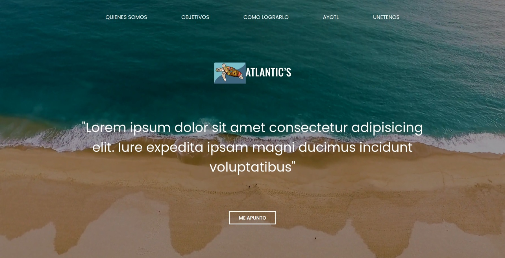
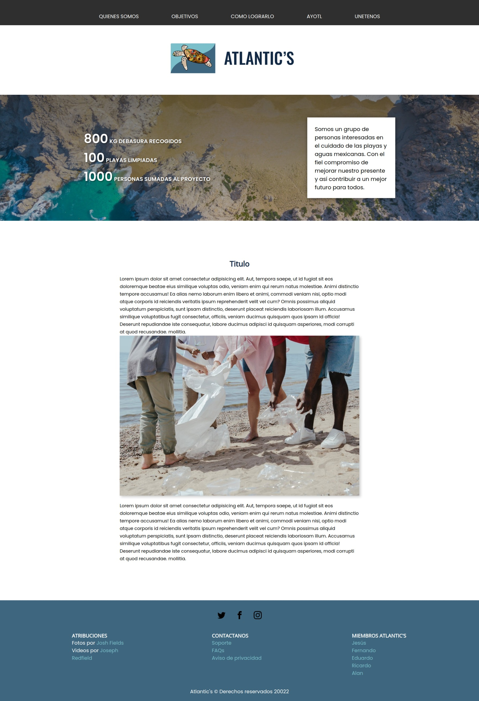

# Atlantic's

Proyecto Atlantic's para Hackathon < Hack the ocean > by Microsoft

[Sitio web](https://ricalc.github.io/Atlantic/)

## Integrantes

<ul>
    <li><a href="https://github.com/Jesus-H-Gonzalez/">Jesús</a></li>
    <li><a href="https://github.com/FerVillalobos">Fernando</a></li>
    <li><a href="https://github.com/edu18RR">Eduardo</a></li>
    <li><a href="https://github.com/RicAlc">Ricardo</a></li>
    <li><a href="https://github.com/AlanGRuiz">Alan</a></li>
</ul>

## Reto

Proponer una solución a las problemáticas ambientales relacionadas con el océano con el fin de ayudar a la vida mariana con ayuda de la tecnología.

## Solución

A través de un sitio web estático, puede brindar una posible solución las especies en extinción, contaminación como; derrames petroleros, prevenir la sobrepesca y la sobre explotación de los mares.

También encontraremos los principales temas ambientales y atención de nuestras playas.

1. Sobre pesca: La causa principal es la pesca ilegal o la pesca de arrastre de profundidad, son dos grandes problemas que aumentan la sobreexplotación, tanto en buques el cual va arrastrando todo a su paso.
   a. Lo ideal es reducir de manera drástica la intensidad de la pesca en la flota mundial.
   b. Se logrará con apoyo local con base en un código de conducta.
   - Pesca responsable y compra de productos pesqueros y que sean de especies en peligro de extinción.
   - Política de control de basura.
   - Política de control de basura.
2. Contaminación: Hay que identificar los principales focos de contaminación química;
   a. Controlar el uso y vertido de químicos en la minería artesanal; promover el reciclado de aceite usado en áreas urbanas.
   b. Incentivar la producción de bienes duraderos que requieran menos energía para fabricar y generar menos desechos a gran escala.
3. Especies en peligro de extinción: De sobra es ya conocido, que en el mar conviven numerosas especies acuáticas, sin embargo, dicho ecosistema está sufriendo importantes pérdidas, muchas de ellas irreversibles, la pesca incontrolada, la acidificación del agua, la gran contaminación que sufren los mares y océanos, y el cambio climático, hacen que las especies como.

- La vaquita marina.

- Ballena gris.

- Manatí

# Screenshots

